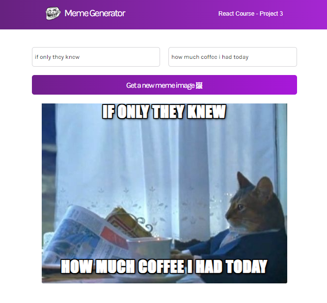

# Scrimba Project - React meme generator

This is a project built with React from the [Scrimba](https://scrimba.com/learn/learnreact) React course. The goal of this project was to learn Event Listeners, State, Conditional Rendering, Forms, and Side Effects. Feedback and questions are welcome! 

## About
This is a meme generator. It consist of a form where you can introduce the text for the top of the image and the text for the bottom of the image. The image comes from an API and you get a new one randomly by pressing the "get a new meme image" button. 

## Tech/framework used
Built with:
* React
* CSS3
* HTML5
* JS

## Demo
Available at https://victoria-parker.github.io/meme-generator-react/